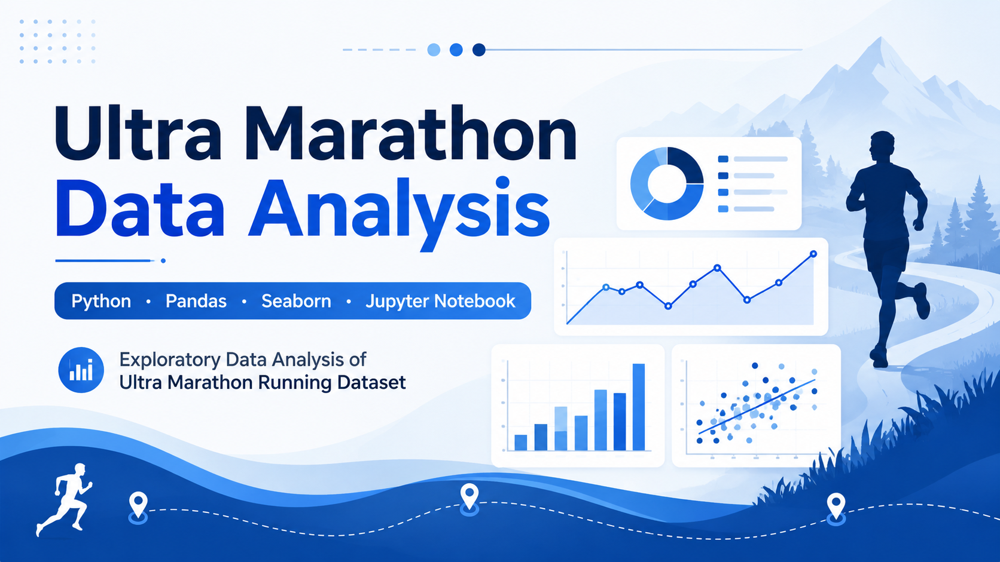
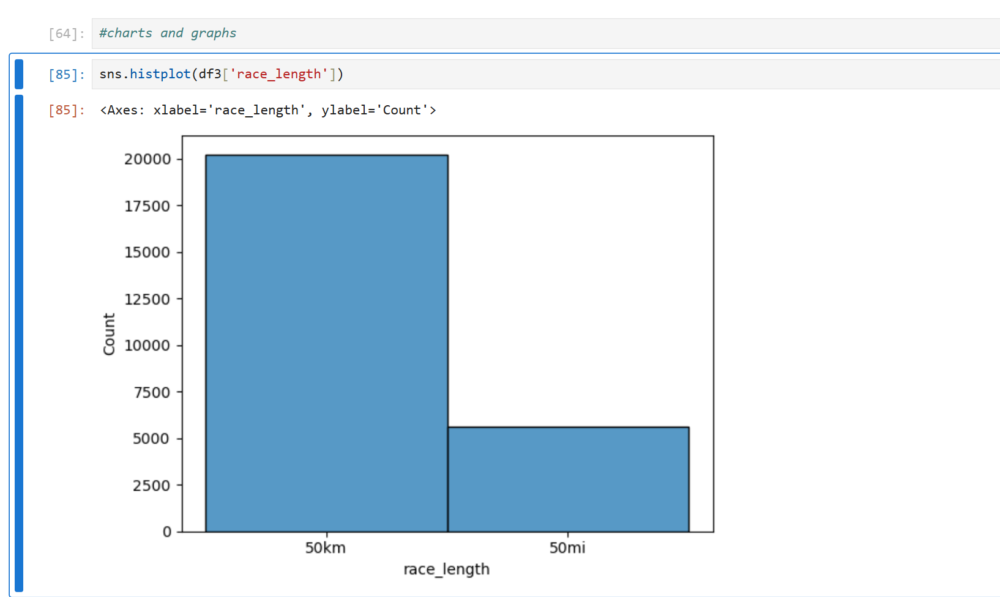
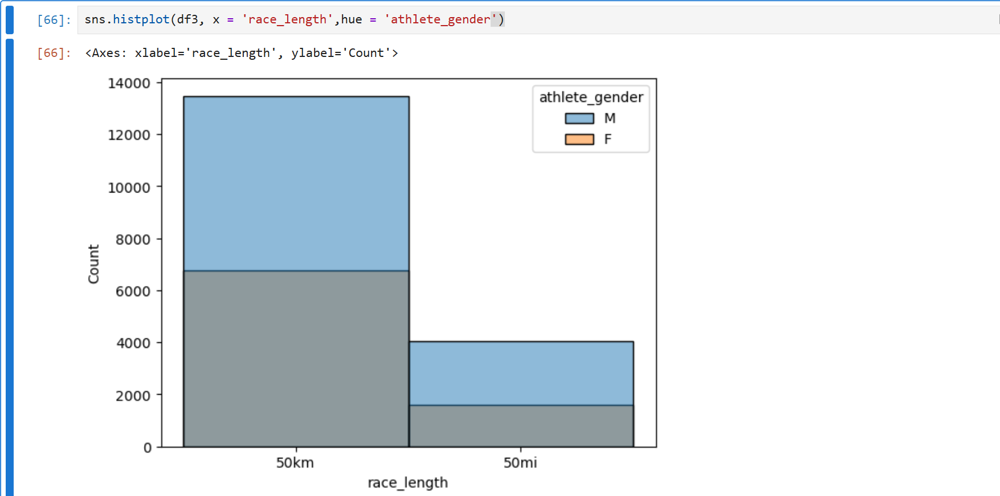
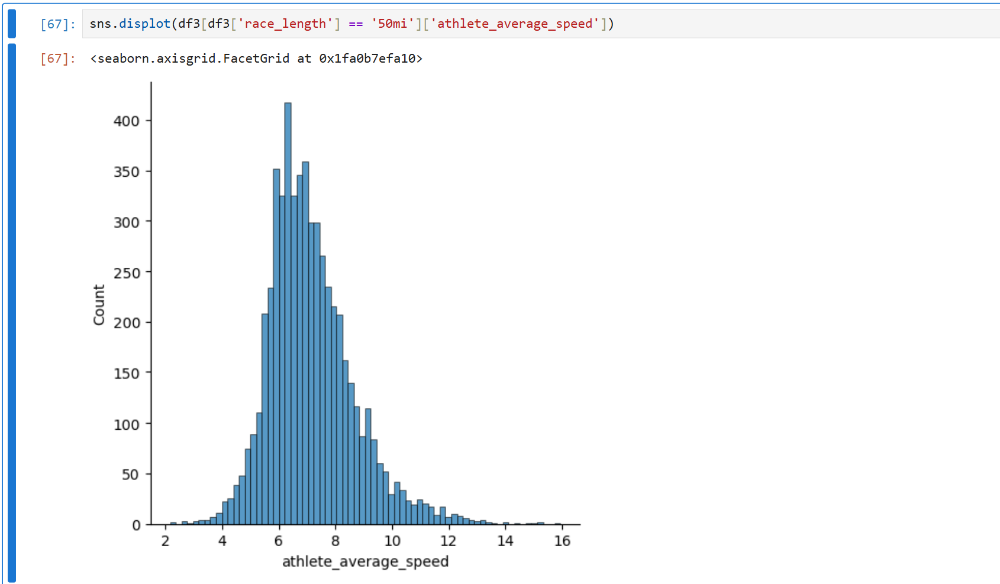
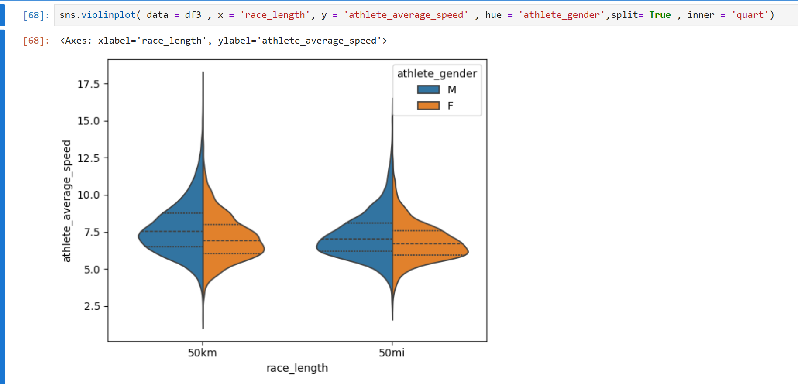
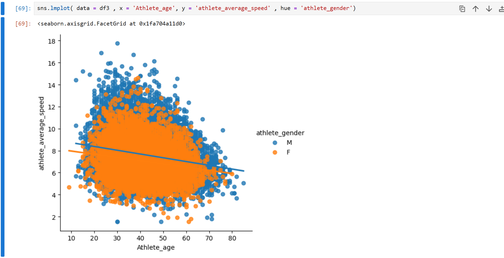

<h1 align="center">🏃 Ultra Marathon Data Analysis</h1>

<p align="center">
Exploratory Data Analysis (EDA) of the Ultra Marathon Running Dataset using Python
</p>

<p align="center">


</p>

<p align="center">

</p>

---

# 📑 Table of Contents

- [📌 Project Overview](#-project-overview)
- [🎯 Objectives](#-objectives)
- [📂 Dataset](#-dataset)
- [🛠️ Technologies Used](#️-technologies-used)
- [💡 Skills Demonstrated](#-skills-demonstrated)
- [📁 Project Structure](#-project-structure)
- [📊 Exploratory Data Analysis Workflow](#-exploratory-data-analysis-workflow)
- [📈 Sample Visualizations](#-sample-visualizations)
- [🔍 Key Insights](#-key-insights)
- [🚀 How to Run the Project](#-how-to-run-the-project)
- [📌 Future Improvements](#-future-improvements)
- [👩‍💻 Author](#-author)

---

# 📌 Project Overview

This project performs **Exploratory Data Analysis (EDA)** on the **Ultra Marathon Running** dataset using **Python**, **Pandas**, **Seaborn**, and **Jupyter Notebook**.

The analysis focuses on cleaning the dataset, exploring race participation, understanding athlete performance, comparing race distances (50 km vs 50 mi), and discovering trends through data visualization.

---

# 🎯 Objectives

- Clean and preprocess the dataset
- Handle missing and inconsistent data
- Analyze race participation trends
- Compare race lengths (50 km vs 50 mi)
- Explore athlete average speed
- Analyze the relationship between age, gender, and performance
- Create meaningful visualizations using Seaborn

---

# 📂 Dataset

**Source:** Kaggle

**Dataset:** The Big Dataset of Ultra Marathon Running

**Dataset Link:**

https://www.kaggle.com/datasets/aiaiaidavid/the-big-dataset-of-ultra-marathon-running

> **Note:** The dataset is approximately **789 MB**, so it is **not included** in this repository due to GitHub's file size limit. Please download it directly from Kaggle.

---

# 🛠️ Technologies Used

| Technology | Purpose |
|------------|---------|
| Python | Programming Language |
| Pandas | Data Cleaning & Analysis |
| Seaborn | Data Visualization |
| Jupyter Notebook | Development Environment |

---

# 💡 Skills Demonstrated

- Exploratory Data Analysis (EDA)
- Data Cleaning
- Data Preprocessing
- Data Filtering
- Feature Engineering
- Data Visualization
- Descriptive Statistics
- Insight Generation

---

# 📁 Project Structure

```text
ultra-marathon-data-analysis/
│
├── data/
│   └── README.md
│
├── notebooks/
│   └── Ultra_Marathon_EDA.ipynb
│
├── images/
│   ├── project_cover.png
│   ├── race_length_distribution.png
│   ├── race_length_by_gender.png
│   ├── average_speed_distribution_50mi.png
│   ├── average_speed_by_race_length_gender.png
│   └── age_vs_average_speed.png
│
├── README.md
├── requirements.txt
└── .gitignore
---

# 📊 Exploratory Data Analysis Workflow

1. Import required libraries
2. Load the dataset
3. Explore the dataset
4. Clean and preprocess the data
5. Filter relevant records
6. Perform Exploratory Data Analysis (EDA)
7. Create visualizations
8. Draw meaningful insights

---

# 📈 Sample Visualizations

## 1️⃣ Race Length Distribution



---

## 2️⃣ Race Length Distribution by Gender



---

## 3️⃣ Athlete Average Speed Distribution (50 mi)



---

## 4️⃣ Athlete Average Speed by Race Length and Gender



---

## 5️⃣ Athlete Age vs Average Speed



---

# 🔍 Key Insights

- **50 km races** have significantly higher participation than **50 mi races**.
- **Male athletes** participated more frequently than female athletes across both race categories.
- Most athletes maintain an average speed between **5–8 mph**.
- Athlete performance tends to decline gradually with increasing age.
- Similar performance trends are observed across race distances, with slight differences between genders.

---

# 🚀 How to Run the Project

## 1. Clone the repository

```bash
git clone https://github.com/pavithra-chandru/ultra-marathon-data-analysis.git
```

## 2. Navigate to the project folder

```bash
cd ultra-marathon-data-analysis
```

## 3. Install the required libraries

```bash
pip install -r requirements.txt
```

## 4. Open the notebook

Open the notebook:

```text
notebooks/Ultra_Marathon_EDA.ipynb
```

using **Jupyter Notebook**.

## 5. Run all cells

Execute all notebook cells to reproduce the analysis and visualizations.

---

# 📌 Future Improvements

- Analyze participation trends across countries
- Perform year-wise performance analysis
- Add more advanced visualizations
- Compare athlete performance across age groups
- Build an interactive dashboard using Power BI or Streamlit

---

# 👩‍💻 Author

**Pavithra**

Aspiring Data Analyst

**Skills:** Python • Pandas • Seaborn • Data Analysis

---

## ⭐ Support

If you found this project useful, consider giving it a ⭐ on GitHub.

It helps others discover the project and motivates me to build more data analysis projects.